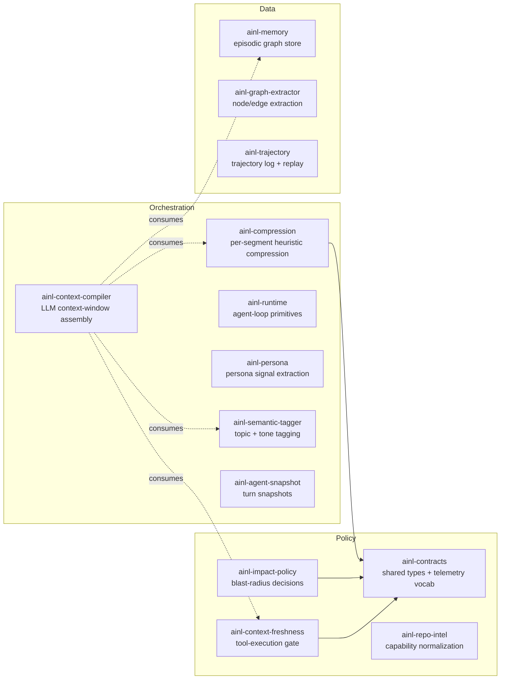

# AINL crates overview

The `ainl-*` crates form a cooperative, dependency-light family that any AINL host
(`armaraos`, `ainl-inference-server`, the AINL MCP, `ainativelang` web) can pull from
without committing to any specific runtime. They group into three families:

## The two `ainl-context-*` crates (boundary table)

These two crates **share a name prefix but solve different problems**. They can be used
independently or together; the compiler crate optionally consumes the freshness crate
as a per-segment rank-down signal.

| Aspect | `ainl-context-freshness` | `ainl-context-compiler` |
|---|---|---|
| Lifecycle phase | **Pre-tool execution** policy gate | **Prompt assembly** / window management |
| "Context" means | the agent's *knowledge of the world* (repo / index state vs HEAD) | the *LLM's input context window* (prompt bytes about to be sent) |
| Key types | `FreshnessInputs`, `impact_decision_*` | `Segment`, `BudgetPolicy`, `ContextCompiler`, `ComposedPrompt` |
| Returns | `ImpactDecision::{AllowExecute, RequireImpactFirst, BlockUntilFresh}` | `ComposedPrompt { segments, anchored_summary, telemetry }` |
| Stateful | No (pure functions) | Builder + per-call orchestrator |
| Optional ML | Never | Tier-gated: heuristic → LLM summarization → embedding rerank |
| Roadmap status | Stable since 0.1 | Phase 6 of [SELF_LEARNING_INTEGRATION_MAP](./SELF_LEARNING_INTEGRATION_MAP.md) |

## When to reach for which crate

- Adding **a new cross-host telemetry field**? → `ainl-contracts`.
- Compressing **a single user prompt** (the original eco-mode use case)? → `ainl-compression`.
- Deciding **whether a tool call is safe** given index staleness? → `ainl-context-freshness`.
- Assembling **the entire LLM input** (system + history + tool outputs + user msg) within a
  token budget, with question-aware ranking and optional anchored summarization?
  → `ainl-context-compiler`.

## Host integration (OpenFang, M1)

ArmaraOS wires the compiler in **measurement mode** first: `openfang-runtime` runs
`ainl_context_compiler::ContextCompiler::compose` on the assembled system prompt + history
+ user message, then stashes the resulting whole-prompt token estimates in
`openfang_runtime::compose_telemetry` (same side-channel idea as `eco_telemetry::record_turn`).
`openfang-kernel` calls `take_compose_turn` when persisting `eco_compression_events` so
dashboard *input tokens not billed* / *USD not spent* reflect the full context window, not
only the compressed user string. M2 replaces the wire-format messages with
`ComposedPrompt.segments` and can surface the compiler tier in API payloads.

## Cross-references

- [`SELF_LEARNING_INTEGRATION_MAP.md`](./SELF_LEARNING_INTEGRATION_MAP.md) §15.6 lists the
  full integration-phase dependency graph.
- [`prompt-compression-efficient-mode.md`](./prompt-compression-efficient-mode.md)
  documents the per-segment compression algorithm reused by the compiler crate.
